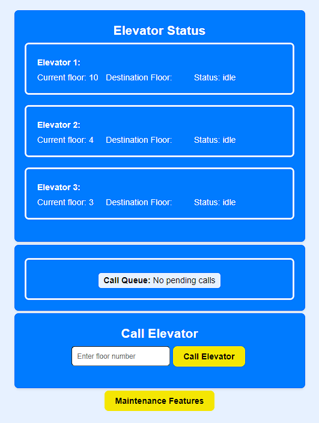

# 🛗 Elevator-App-MySQL

## ElevatorApp

## Table of Contents

- [Project Overview](#1-project-overview)
- [Installation and Setup](#2-installation-and-setup)
- [Project Features](#3-project-features)
- [Project Structure](#4-project-structure)
- [Technologies Used](#5-technologies-used)

### **1. Project Overview**

- **Project Name:** ElevatorApp
- **Description:** ElevatorApp is a Node.js application for managing a network of elevators. It provides API endpoints for calling elevators to specific floors, checking elevator availability, and tracking elevator status. This version uses MySQL to store data and has a React frontend that calls endpoints.

### **2. Installation and Setup**

#### **Requirements:**

- Node.js
- npm (Node Package Manager)
- MySQL

#### **Installation:**

1. **Clone the Repository:**
   ```bash
   git clone https://github.com/PhilHacks/Elevator-App-MySQL.git
   ```
2. **Navigate to the Project Directory:**
   ```bash
   cd Elevator-App-MySQL
   ```
3. **Install the required Dependencies:**
   ```bash
   npm install
   ```

### **Database Initialization and Configuration**

Ensure your MySQL database is set up and configured before launching the application. Follow these steps to prepare your environment:

#### **Install MySQL:**

- Download the MySQL Community Server from [MySQL Downloads](https://dev.mysql.com/downloads/mysql/). Select the version compatible with your OS and follow the installation instructions.
- **Important:** Take note of the MySQL root user's password during installation.

#### **Configure Database Connection:**

1. **Create a `.env` File:**

   - In the root directory of your project, create a `.env` file. This file will securely store your database connection details, keeping them out of version control.

2. **Populate `.env` with MySQL Details:**

   - Fill in the `.env` file with your MySQL connection information. Ensure to replace `your_root_password` with the actual password set during MySQL installation:
     ```plaintext
     DB_HOST=localhost
     DB_USER=root
     DB_PASS=your_root_password
     DB_NAME=sql_elevators
     ```

3. **Integration with `dbConnect.js`:**
   - The `.env` file's values are imported into the `dbConnect.js` script to establish the database connection, safeguarding your sensitive details.

#### **Initialize the Database:**

- Verify that your MySQL service is active. Then, use the script provided to initialize your database schema:
  ```bash
  npm run init_db
  ```

#### **Launch the Application:**

To incorporate your request into the "Launch the Application" section and align with the clarity and straightforwardness of your README, it could be revised as follows:

### **Launch the Application:**

With the database prepared, you'll need to start both the backend and frontend servers to get the application running fully.

#### **Start the Backend Server:**

1. **Navigate to the Backend Directory:**
   ```bash
   cd backend
   ```
2. **Start the Backend Server:**
   ```bash
   npm start
   ```
   - This will start the backend server. The backend API will now be accessible at `http://localhost:5000`.

#### **Start the Frontend Server:**

1. **Open a New Terminal Window:**
   - Ensure the backend server is running in its terminal window. Open a new terminal window for the frontend server.

2. **Navigate to the Frontend Directory:**
   ```bash
   cd ../frontend
   ```
   - Note: If you're starting from the project's root directory again, adjust the path accordingly.

3. **Start the Frontend Server:**
   ```bash
   npm start
   ```
   - This will start the frontend server and usually opens the application in your default web browser automatically. If not, you can manually navigate to the address provided in the terminal: `http://localhost:3000`.

### **3. Project Features**

This application offers several API endpoints for managing and tracking elevators:

- `POST /callElevator`                 - Call Elevator to floor
- `GET /elevator/status`               - Elevator Status of all elevators
- `GET/callqueue/`                     - Fetch Call Queue Table
- `GET/elevator/available/:elevatorId` - Check if specific elevator is available
- `PUT /updateElevatorStatus`          - Update Elevator Status

### **4. Project Structure**

The project is divided into two main parts: `backend` and `frontend`.

#### Backend

The backend codebase is located in the `backend` directory and it's structured as follows:

```
backend/
├── src/
│   ├── createdb.sql
│   ├── crudOperations.js
│   ├── databaseSetup.js
│   ├── dbConnect.js
│   ├── elevatorManager.js
│   └── routes.js
├── .gitignore
├── main.js
└── package.json
```

#### Frontend

The frontend codebase is located in the `frontend` directory and it's structured as follows:

```
frontend/
├── src/
│   ├── components/
│   │   ├── CallElevator.jsx
│   │   ├── CallQueue.jsx
│   │   ├── ElevatorStatus.jsx
│   │   ├── UpdateStatus.jsx
│   ├── services/
│   │   └── ElevatorServices.js
│   ├── App.css
│   ├── App.js
│   ├── App.test.js
│   ├── index.css
│   ├── index.js
│   ├── logo.svg
│   ├── reportWebVitals.js
│   ├── setupTests.js
├── .gitignore
├── README.md
├── package-lock.json
└── package.json
```

## Image of Elevator App



### **5. Technologies Used**

- Backend: Node.js, Express.js, MySQL
- Frontend: React, Axios
