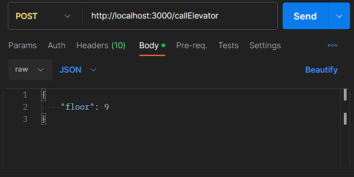

# ElevatorApp


**Table of Contents**
- [Project Overview](#project-overview)
- [Installation and Setup](#installation-and-setup)
  - [Requirements](#requirements)
  - [Installation](#installation)
- [Project Features](#project-features)
  - [List of Features](#list-of-features)
  - [Usage Examples](#usage-examples)
    - [Calling an Elevator](#calling-an-elevator)
    - [Checking Elevator Availability](#checking-elevator-availability)
- [Project Structure](#project-structure)
  - [Directory Structure](#directory-structure)
  - [Key Files](#key-files)
- [Technologies Used](#technologies-used)
  - [Languages](#languages)
  - [Frameworks/Libraries](#frameworkslibraries)
#

### **1. Project Overview**

- **Project Name:** ElevatorApp
- **Description:** ElevatorApp is a software system for managing a network of three elevators using Node.js and Express.js. It provides an API for calling and controlling elevators efficiently. With ElevatorApp, users can:

  - **Call Elevator:** Users can call an elevator to a specific floor by sending a POST request to /callElevator.

  - **Simultaneous Calls:** ElevatorApp allows multiple users to simultaneously call elevators to different floors, and the system efficiently assigns the nearest available elevator.

  - **Status Information:** Users can easily retrieve the status of all elevators by sending a GET request to /elevator/status.

  - **Elevator Availability:** The system enables users to check if a specific elevator is available by sending a GET request to /elevator/available/:elevatorId.

  This solution ensures a smooth and efficient elevator management system.
#

### **2. Installation and Setup**

#### **Requirements:**

Before you can run ElevatorApp, make sure you have the following prerequisites and dependencies installed on your system:

- **Node.js:** Ensure you have Node.js installed. You can download it from [nodejs.org](https://nodejs.org/).

- **npm (Node Package Manager):** npm comes bundled with Node.js. You can verify its installation by running `npm -v` in your terminal.

- **Express.js:** ElevatorApp uses the Express.js framework for API endpoints. You can install it using npm:

  ```bash
  npm install express
  ```

- **Other Dependencies:** To install other project-specific dependencies, navigate to your project directory and run:

  ```bash
  npm install
  ```

Now that you have the required prerequisites and dependencies in place, let's proceed with setting up the project.

#### **Installation:**

Follow these steps to set up ElevatorApp locally:

1. Clone the repository to your local machine:

   ```bash
   git clone https://github.com/your-username/elevator-app.git
   ```

2. Navigate to the project directory:

   ```bash
   cd elevator-app
   ```

3. Install project-specific dependencies:

   ```bash
   npm install
   ```

4. Start the server:

   ```bash
   node elevatorServer.js
   ```

   The ElevatorApp server will now be running, and you can access it at `http://localhost:3000` in your web browser.
#
### **3. Project Features**

#### **List of Features:**

- **Call Elevator:** Users can call an elevator to a specific floor by sending a POST request to `/callElevator`.
  
- **Simultaneous Calls:** Multiple users can simultaneously call elevators to different floors, and the system efficiently assigns the nearest available elevator.
 

- **Status Information:** Users can retrieve the status of all elevators by sending a GET request to `/elevator/status`.
 

- **Elevator Availability:** Users can check if a specific elevator is available by sending a GET request to `/elevator/available/:elevatorId`.
 

#### **Usage Examples:**

##### Calling an Elevator:

To call an elevator to a specific floor (e.g., floor 9), send a POST request with JSON data example below is using postman:





##### Checking Elevator Availability:

To check if Elevator 1 is available, send a GET request to `/elevator/available/1`.

#
### **4. Project Structure**

#### **Directory Structure:**

The project is organized as follows:

- `elevatorManager.js`: Contains the main logic for managing elevators and the elevator system.

- `elevator.js`: Defines the Elevator class.

- `elevatorServer.js`: Initializes the Express.js server and API endpoints.

- `node_modules/`: Contains project dependencies installed via npm.

- `README.md`: This readme file.

#### **Key Files:**

- `elevatorManager.js`: The core logic for elevator management and the elevator system.

- `elevator.js`: Defines the Elevator class with methods for elevator movement.

- `elevatorServer.js`: Initializes the Express.js server and API endpoints.

#
### **5. Technologies Used**

#### **Languages:**

- JavaScript (Node.js)

#### **Frameworks/Libraries:**

- Node.js
- Express.js

